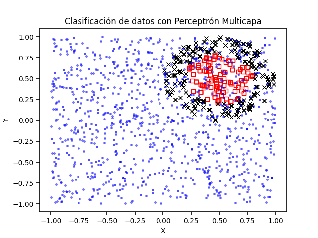

# Practica 1 Ejercicio 3 - Perceptrón Multicapa
## Autor: Cárdenas Pérez Calvin Cristopher

## Descripción del proyecto

Este proyecto consiste en la implementación de un algoritmo de retropropagación para un perceptrón multicapa en Python, que permite la clasificación de datos utilizando una red neuronal artificial. La cantidad de capas de la red y la cantidad de neuronas para cada capa pueden ser configuradas libremente.

## Funcionamiento del programa

### Lectura de datos: 
El programa carga los datos desde el archivo concentlite.csv.
Configuración de la red neuronal: Se define la arquitectura de la red, incluyendo el número de capas ocultas y neuronas por capa.

###Entrenamiento de la red neuronal: 
Se entrena la red utilizando el algoritmo de retropropagación durante un número de épocas especificado.

### Clasificación de datos: 
Se utilizan los datos de entrada para realizar predicciones con la red neuronal.
Visualización de resultados: Se grafican los datos junto con la clasificación realizada por la red neuronal.

## Archivos

En esta carpeta se encuentran: 
- [El código fuente](Archivos/Algoritmo_de_repropagacion.py)
- [El archivo de datos](Archivos/concentlite.csv)

## Reporte

Contiene un informe detallado sobre la implementación del algoritmo y los resultados obtenidos.

## Resultados

A continuación se muestra la gráfica que ilustra la clasificación de datos realizada por el perceptrón multicapa:

